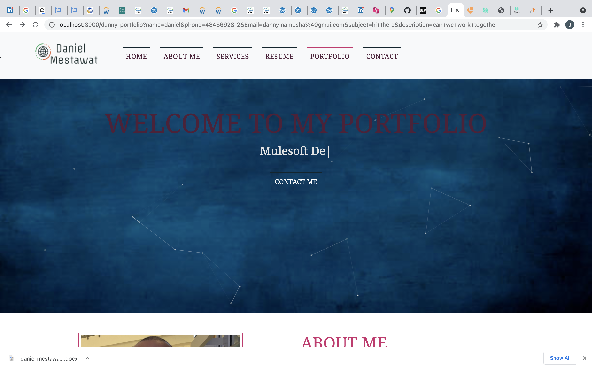
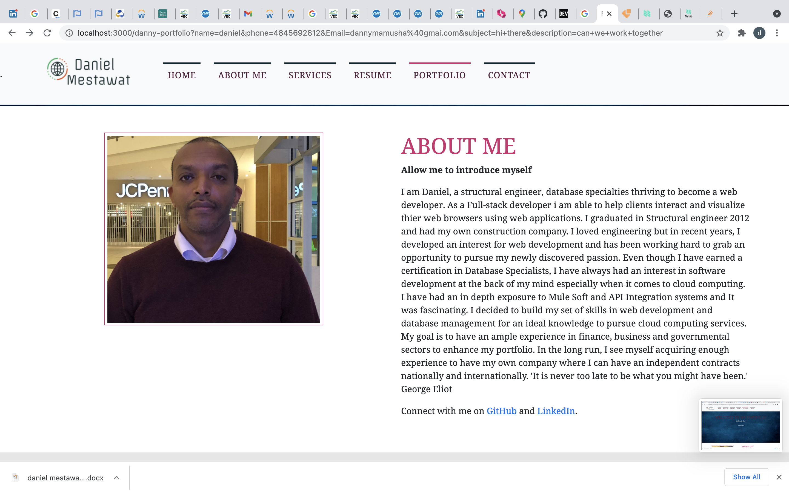
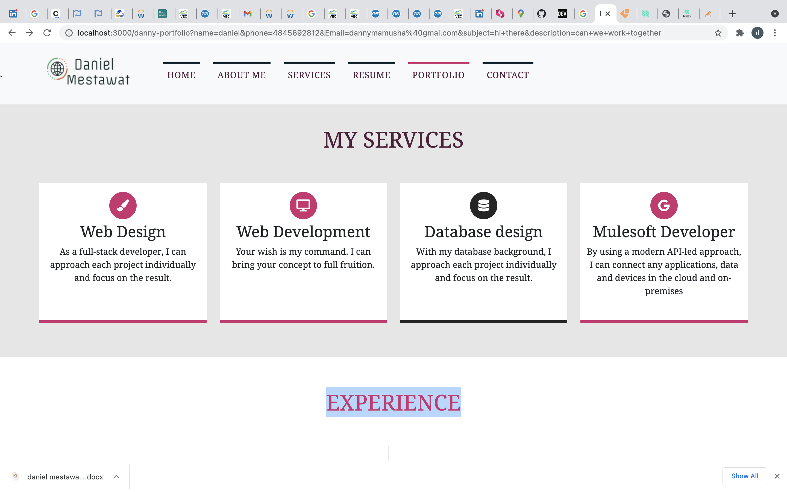
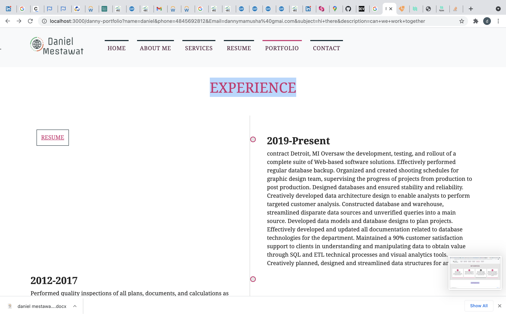
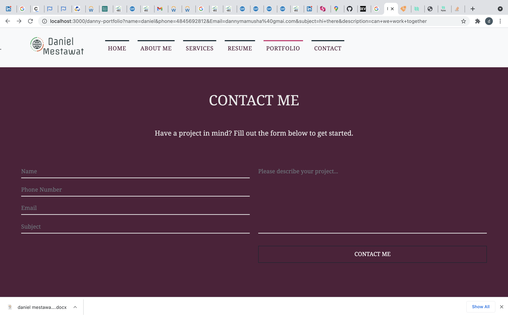
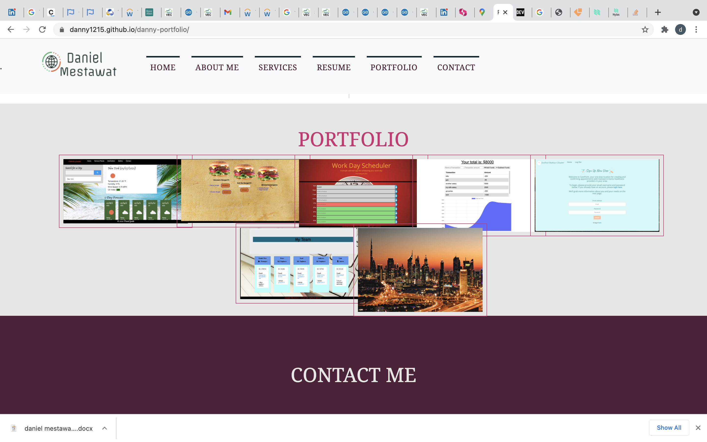

# danny-portfolio

### by Daniel Mestawat

### Description

This Application can be used in any browser available. The purpose of this Web page is as my React-Portofolio to provide what i have work as a Full-stack developer.

### HOW TO USE THE APPLICATION

- Clone this repository.
- Open in any browser available.
- Type "npm run start" to deploy the application on PORT 3000.
- It can be used as a sending email, linkden profile,github profile, my Resume, all the projects with thier link and github repository and all the contacts you need is available in the Portfolio.

### Technologies Used

- React
- Nodejs
- React Bootstrap
- Emailjs

## LINK TO THE REPOSITORY

-The link is [Updated Portofolio-Third](https://github.com/danny1215/danny-portfolio)

##  DEPLOYED LINK

- The link is (https://danny1215.github.io/danny-portfolio/)

## LICENCE

- MIT

## SCREENSHOTS

 

